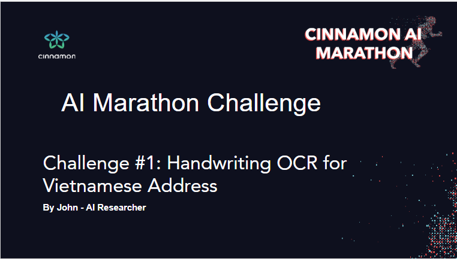
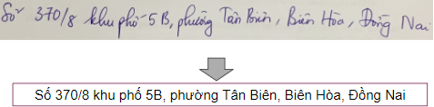
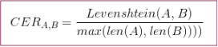

# Overview
This is also a AI Cinnamon competition in 2018

# Challenge statement

Given an image of a handwritten line, participants are required to create an OCR model to transcribe the image into text.

# Evaluation metrics

Evaluation is based on character error rate (CER).CER is calculated based on Edit distance (or Levenshtein distance).Given a predicted string A, and the ground truth string B, CER is specified by:

# Project structure

## model.py

We use VGG16 as features extracter , which accepts input shape (2048,64,3). Before data flows through LSTM layers , it goes by a attention layer. We set up 2 modes. The first one is for training phase , where inputs are 4 arrays and output is loss function array . The second one is for prediction , where input is image array only and output is our prediction.

Type : `python model.py` to see summary of our model

## load_data.py

Data we used is provided by Cinamon AI 2018.We set up a class which provides some methods to help us build data for feeeding model.Also including some data augmentations.Actually we feed model in batch thanks to next_bacth() method.It is just a supporting module. We will not working on it

## train.py

Here you can train our model.You can follow some instructions to adjust hyperparameters as desire.For default we set up training phase with 1 epoch ,batch_size 32 , learning rate 0.0001 and name of model saved is dinh_nana.h5.Of course you can change it in file train.py.But we recommend training here just help you feel how everything works,don't use this model in prediction

Then type : `python train.py`

## predict.py
See how good model predict by typing `python predict.py`

## evaluate.py

Here you can find a function to compute some errors like WER , CER , SER.That means it is just also supporting module. We will not also working on it

## data/raw

Here you need to upload data to this folder. Also note that you attach file labels.json,which contains ground truth

## model

Here the place our model will be saved. We also prepare a pre - trained model called dinh_model.h5 for predicting immediately if you are so lazy to train something new.However because of memory on Github,we don't include our model.You can download dinh_model.h5,create a folder called model and move file into this folder

Download [here](https://drive.google.com/file/d/1WPgAN4ypI0jTFIw_GW0TuijE8O-UXwsM/view?usp=sharing)

## private_test

This folder contains private test set of this competition.We also do not include.For now,you can create the new one and throw your desire test set into it

Our results for this competition is :

- CER :  0.09158184772813775
- WER :  0.28985354889405085
- SER :  0.9544626593806922

